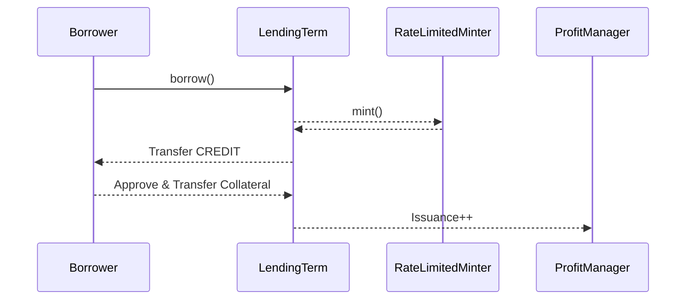
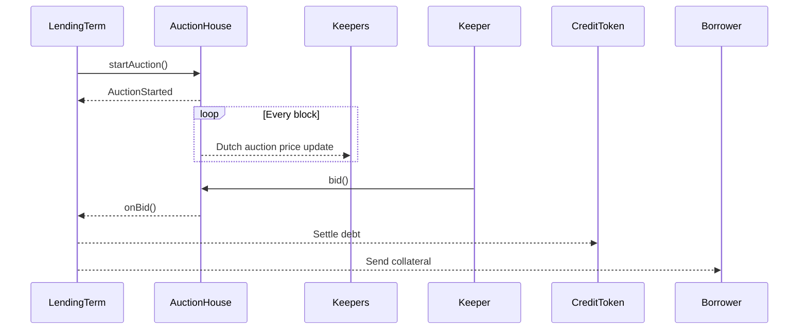
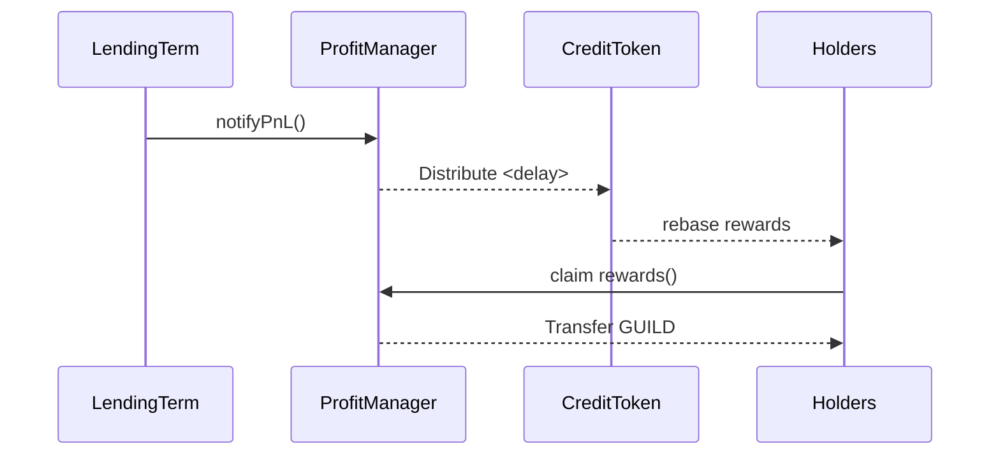

Introduction

 

**The why and how of trust minimized pooled lending**

The Credit Guild is a protocol for trust minimized pooled lending on the Ethereum network. Its goal is to scale governance to support a larger set of assets and loan terms, while minimizing third party risk.

**Pooled Lending**
The majority of lending on Ethereum is pool-to-peer, where a large number of lenders deposit assets into a pool whose parameters are governed by a set of tokenholders, with price updates provided by a trusted oracle, and individual borrowers provide collateral and borrow from the pool at their discretion. Even liquid staking protocols can be viewed as lending pools, since they borrow ETH from depositors and lend it to operators who may or may not post collateral, as well as setting the interest rate paid by borrowers to lenders, and taking a margin.

Pooled lending is dominant because most users cannot successfully perform competitive pricing of collateral, nor set competitive market interest rates. Neither individual borrowers nor lenders provide quotes regarding collateralization, interest rate, or other loan parameters. Instead, they attempt to discriminate between pools on the basis of the publicly available evidence of security, history of yield, and perhaps because a pool is the only venue that supports a trade they wish to make in adequate size.

The goal of the Credit Guild is to scale the benefits of pooled lending, while reducing the trust assumptions it usually entails.

**Trust Minimized <> Highly Scalable**
Existing pooled lending protocols like Aave, Compound, or MakerDAO all rely on both an honest majority of tokenholders and the correct function of a trusted oracle. The failure of either of these can result in the total loss of user funds.

The Credit Guild adopts an optimistic or vetocratic mode of governance. A minority of GUILD holders can propose new lending terms or changes to system parameters like the interest rate split between GUILD stakers, lenders, and the surplus buffer. Both GUILD holders and protocol depositors have the ability to veto changes. GUILD holders can also vote to offboard existing lending terms and close outstanding loans. Taking inspiration from 

The major actions taken by GUILD and depositors (proposing terms, proposing governance changes, offboarding terms, vetoing onboarding proposals or proposed governance changes) demand different quorum thresholds and appropriate latencies. Offboarding a lending term must be swift and unvetoable, or else the protocol risks bad debt exposure. Only GUILD holders can perform offboarding, as otherwise the cost to grief the protocol by offboarding all terms would be too low. Onboarding a lending term should be swift in the optimistic case but easy to veto, since it's not too difficult for voters to evaluate whether or not the term is sound. Code changes such as upgrading to a new auctionHouse contract are more complex and demand a longer timelock to ensure proper review is conducted. See 

Separating different kinds of governance actions into separate flows, and requiring only an honest minority to be present to perform vetos, allows the protocol to scale much more easily than a conventional lending pool. Major lending pools today support at most a few dozen unique loan terms, the Credit Guild is intended to support thousands, reflecting the growing market of cryptonative assets, independent liquid staking token providers, and "real world asset" tokenizers, as well as the potential to lend at varied durations and collateralizations for each.

**Liquidations and Bad Debt**
Liquidations in the Credit Guild occur once a lending term has been offboarded. There is no penalty, so it is is less punitive compared to a traditional oracle-triggered liquidation, closing the borrower's position for the minimum cost and retaining as much of their collateral as possible.

Legacy lending pools like Aave, Compound, and Maker lack mechanisms to mark down bad debt. This means that if two people each lend $100, and the protocol accrues bad debt of $100, the first person to withdraw gets their full $100 back, while the second is stuck and can withdraw $0.

The Credit Guild mitigates this risk by pausing withdrawals while liquidations are in progress. If any loss occurs, it is marked down along with unpausing withdrawals. That means that if bad debt occurs, passive lenders are not at a disadvantage, and the market can continue to function without disruption.

**Incentive Aligned <> Skin in the Game**
When GUILD holders propose a new lending term, it starts with a debt ceiling of zero. The debt ceiling is increased by stakers who vote for that term in a gauge. Either GUILD tokens or the market's deposit receipt token (gUSDC, gETH, and so on) can be staked to increase the debt ceiling of a given term. Stakers earn a portion of the yield generated by the loans they are staking on, and also face slashing in the case of losses.

This mechanism, which we call Market Governance, seeks to allow a wide variety of independent market actors to participate as first loss capital. These active lenders allocate liquidity in the system, earning a premium over the passive lenders in exchange for taking on the risk of whichever loans they vote for. A set of participants acting independently, choosing their own isolated risk and yield exposure, allows for a more expressive system than one which requires everybody agree on every decision.

An individual GUILD holder has a strong incentive to offboard loans they have voted for in a timely manner if they have become unsafe, lest they be slashed. Slashing is total regardless of the magnitude of the loss. In the case of a negligent or dishonest GUILD holder, their fellow holders have an incentive to offboard the term to slash the offender and grow their own share of the pie, as well as minimizing losses to the surplus buffer.

**Approach**

I thoroughly reviewed the entire 2000+ SLOC of core protocol code across 20 contracts. I focused on analyzing logical flow, key mechanisms, risk surfaces, and alignment with stated goals of credit neutrality and censorship resistance.

My approach involved:

- Developing process flow diagrams for each major protocol component like lending, liquidations, profit sharing etc. to analyze sequencing, dependencies, and failure modes.

**Borrowing & Lending**

Potential failure modes:
- Collateral transfer reverts
- Debt ceiling reached
- External dependency fails

**Liquidations**

Failure modes:
- Auction expires with no bids 
- Settlement transaction reverts

**Profit Sharing**

Failure modes:
- Overflow or rounding errors
- Token transfer reverts

- Cataloging all external contracts referenced and reviewing their role, privileges, upgradability, and security posture 
- Identifying central points of failure or control and validating backup plans
- Evaluating incentive alignments between various token holders and keepers
- Considering flaws in mechanisms or parametrization that could lead to policy exploitation
- Checking for consistency of accounting logic across complex scenarios like partial repayments
- Considering exploitation vectors from both external threats and insider governance attacks 

**Architecture**

The architecture consists of modular, upgradeable components for lending, auctions, profit distribution etc. This separation of concerns provides flexibility to improve modules without central points of failure.  

It delegates key logic to autonomous contracts like [ProfitManager.sol](https://github.com/code-423n4/2023-12-ethereumcreditguild/blob/main/src/governance/ProfitManager.sol) and [AuctionHouse.sol](https://github.com/code-423n4/2023-12-ethereumcreditguild/blob/main/src/loan/AuctionHouse.sol). This minimizes need for direct governance control during operations.

**Modular Components**

The Ethereum Credit Guild protocol is comprised of various self-contained components for key functions:

- **Lending** - [LendingTerm.sol](https://github.com/code-423n4/2023-12-ethereumcreditguild/blob/main/src/loan/LendingTerm.sol) handles borrowing, repayments, liquidations
- **Auctions** - [AuctionHouse.sol](https://github.com/code-423n4/2023-12-ethereumcreditguild/blob/main/src/loan/AuctionHouse.sol) runs collateral auctions 
- **Profit Sharing** - [ProfitManager.sol](https://github.com/code-423n4/2023-12-ethereumcreditguild/blob/main/src/governance/ProfitManager.sol) tracks interest earnings
- **Stablecredit** - [SimplePSM.sol](https://github.com/code-423n4/2023-12-ethereumcreditguild/blob/main/src/loan/SimplePSM.sol) mints/redeems gUSD at target price  

Each component has focused responsibilities aiming for separation of concerns. For example, `LendingTerm` manages user balances and loan state while `AuctionHouse` runs collateral auctions without being tightly coupled.

This modularity has 2 key advantages:

1. **Decentralization** - Components operate independently without centralized control during normal function. For example, the `AuctionHouse` progresses auction timing and outcomes autonomously.

2. **Upgradability** - Specific components can be improved without affecting others. This capability will be essential for iterating mechanisms over time as weaknesses are discovered with minimal disruption.

As the system grows, new lending terms and auction houses can compete in parallel. As long as they conform to standard profit sharing interfaces, the ecosystem progresses in an interoperable way.

**Autonomous Components** 

Within the architecture, there is a further distinction between components like:

- `LendingTerm` - governing business logic
- `ProfitManager` - governing incentive distribution 

Components governing core incentives and participation like `ProfitManager` are deployed autonomously without admin privileges. This helps minimize reliance on trusted roles after system initiation.

The architecture philosophy focuses on designing modular, decentralized components managing specific mechanisms. This aligns with the protocol's goals for credibly neutral infrastructure controlled by its users.

**Recommendations**

- Decentralize control and upgrade capability for most privileged components like `Core` and `ProfitManager`
- Expand configurability of adjustable policy parameters in `AuctionHouse` and other components
- Create a formal model of systemic interconnections and risk thresholds as debt ceilings between isolated lending markets are linked
   
**Code Quality**

The codebase follows best practices like:

- Separate logical contracts for each mechanism
- Extensive natspec comments documenting behavior  
- Consistent style and formatting
- Use of established libraries for common needs
    
Room for improvement:

- Expanded test coverage of complex edge case scenarios
- Increased use of events for debugging traceability
- Runtime gas optimization opportunities

**Modularization**

The codebase excels at splitting logical components into separate contracts based on responsibility including:

- [LendingTerm.sol](https://github.com/code-423n4/2023-12-ethereumcreditguild/blob/main/src/loan/LendingTerm.sol) - Borrowing and liquidations
- [AuctionHouse.sol](https://github.com/code-423n4/2023-12-ethereumcreditguild/blob/main/src/loan/AuctionHouse.sol) - Collateral auctions
- [ProfitManager.sol](https://github.com/code-423n4/2023-12-ethereumcreditguild/blob/main/src/governance/ProfitManager.sol) - Distribution of interest

This aligns with best practices for separation of concerns between mechanisms.

**Documentation**

The use of extensive NatSpec comments is exemplary for communicating intended behavior at both a contract and function level.

Comments clearly explain key logic, dependencies, invariants, and events. This significantly improves auditability and upgradeability by new contributors.

**Consistency**

Style and formatting like spacing, ordering of variables, and bracing conform to Solidity standards. This creates familiarity and scan-ability for readers of the code.

**Libraries**

Use of battle-tested libraries like OpenZeppelin AccessControl and SafeMath enhances security and trust by building on peer-reviewed code. 

Custom reusable logic around functionality like rate limiting demonstrates good engineering.

**Test Coverage**

While core application logic has reasonable path coverage, adding further scenario-based tests would build more confidence.

Some examples of complex scenarios worth testing:
- Multi-step liquidation auction behaviors
- Interactions spanning multiple contracts like profit sharing
- Extreme conditions like rapid price fluctuations
 
**Events & Tracing**

The protocol already implements informative debug events at key state transition points.

Expanding events for tracing requests across contract boundaries could further improve diagnosability. 

**Optimization** 

As expected for the initial version, opportunities likely exist for runtime gas improvements in areas like bulk operations.

**Centralization**

Initial centralization around TIMELOCK and GOVERNANCE roles for bootstrapping. Planned decentralization is good. The main residual risk is the potential for insider attacks from early token holders to extract value.

The Ethereum Credit Guild protocol grants elevated privileges to specific roles for initialization and governance control.

The key privileged roles are:

**Governor**

Holds ultimate control to:

- Upgrade contracts
- Modify parameters
- Add/remove lending terms

Governor is initially a multi-signature wallet to facilitate bootstrapping.

**Guardian** 

Able to freeze/unfreeze protocol usage including:

- Block new loans
- Disable auctions
- Freeze funds

Guardian is initially team controlled to handle emergencies.

**Decentralization Roadmap**

The plan is to transition protocol control and treasury funds to decentralized governance via the GUILD and gUSD token holders.

Timelocks will be enforced around decision making to align incentives.

This should sufficiently decentralize the system over time.  

**Residual Risks**

However, elevated insider influence from large early token allocations remains a risk.

Whales could dominate governance or guardian votes to extract value over minority stakeholders rather than maximizing alignment. 

Ongoing incentives management is critical to maintain decentralization as visioned.

**Core Mechanisms**

- **Borrowing/Lending**
  - Key risks around collateral eligibility and preventing minting manipulation
  - Failure mode is geeky liquidation, no loss of funds
- **Liquidations** 
  - Fairly efficient Dutch auctions
  - Gaming vectors with timing and borrower profits
- **Profit Sharing**
  - Novel interpolated distribution mechanic
  - Need to ensure accuracy over time
  
**Borrowing & Lending**

The decentralized lending terms allow opening collateralized debt positions with varying risk parameters.

Key risks stem from collateral eligibility and manipulation of minting limits.

If flawed assets are used or debt ceilings breached, loans would simply liquidate without actual losses.

However, there could be denial of service impacts blocking usage for honest borrowers.

**Liquidations**

The novel Dutch auction approach aims to maximize debt recovery during liquidations by making the collateral bid price more favorable over the timed auction.

This works well in aligned environments but has some gaming vectors.

Attackers could profit by intentionally allowing positions to get liquidated then acquiring the discounted collateral.

This could be mitigated via tuning auction parameters and incentives over time.

**Profit Sharing**

The profit sharing mechanism using interpolated token rebasing aims to fairly distribute earned interest over time.

The key risk is ensuring the math for calculating dynamic allocations and shares preserves expected values without rounding errors accumulating.

Thorough auditing along with capping distributions would mitigate concerns.

There is also reliance on the autonomous `ProfitManager` contract that governs reward flows. Its permissions and controls need scrutiny to avoid misuse over time.

**Incentives**

Generally well-aligned between creditors, guild members, and keepers.

Potential misalignments during liquidations and borrowers profiting.

I believe the current design represents a strong foundation with reasonable decentralization.

### Time spent:
56 hours